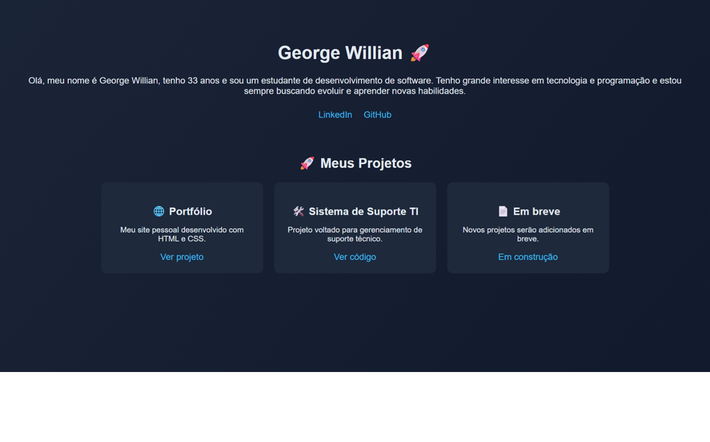

# 🚀 Portfólio - George Willian

Este é o meu portfólio pessoal, desenvolvido para apresentar minha trajetória, habilidades e evolução na área de Tecnologia da Informação.

## 👨‍💻 Sobre mim

Olá! Me chamo George Willian, tenho 33 anos e sou estudante de desenvolvimento de software.
Tenho grande interesse em tecnologia e programação, e estou em constante evolução para me tornar um desenvolvedor e criar soluções que impactem positivamente a vida das pessoas.

## 🌐 Acesse o projeto

👉 https://georgewcs7-prog.github.io/meu-site/

## 🛠️ Tecnologias utilizadas

* HTML5
* CSS3

## 🎯 Objetivo do projeto

* Criar um portfólio profissional
* Apresentar minhas habilidades
* Compartilhar minha evolução na área de TI

## 📸 Preview do site

## 📈 Próximas melhorias

* Adicionar JavaScript para interatividade
* Criar seção de projetos
* Melhorar responsividade (mobile)
* Implementar animações

## 📫 Contato

* LinkedIn: (www.linkedin.com/in/george-sampara)
* GitHub: https://github.com/georgewcs7-prog

---

💻 Desenvolvido por George Willian

